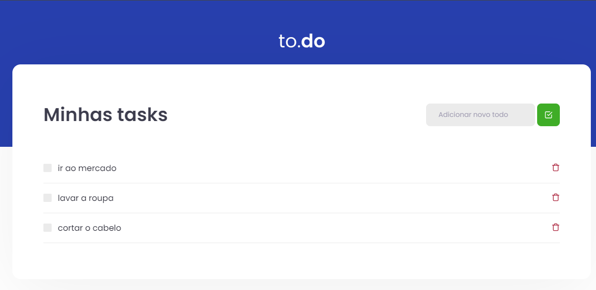

# FRONT-END - TO.DO - TYPESCRIPT, REACT, BABEL, SASS, JEST, WEBPACK

TO.DO é um projeto de front-end desenvolvido com foco na organização e gestão de tarefas. Utilizando tecnologias modernas como TypeScript, React e SASS, o TO.DO oferece uma interface intuitiva e responsiva para criar, visualizar e gerenciar suas tarefas diárias. Com suporte para testes unitários usando Jest e otimização de código com Babel e Webpack.

## Tecnologias Utilizadas

- TYPESCRIPT
- REACT
- BABEL
- SASS
- JEST
- WEBPACK

## Funcionalidades

- Criar Tarefa: Os usuários podem criar novas tarefas para serem adicionadas à lista.
- Apagar Tarefa: Os usuários têm a opção de apagar uma tarefa existente da lista.
- Marcar Tarefa como Concluída: Os usuários podem marcar uma tarefa como concluída, indicando que ela foi realizada com sucesso.

# Testes

- Deve ser capaz de adicionar uma tarefa.
- Não deve ser capaz de adicionar uma tarefa com título vazio.
- Deve ser capaz de remover uma tarefa.
- Deve ser capaz de marcar uma tarefa como concluída.

## Links
