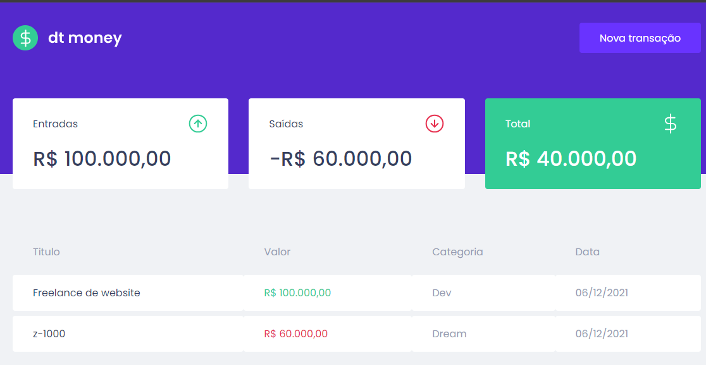

# FRONT-END - DTMONEY - TYPESCRIPT, AXIOS, MIRAGEJS,  STYLED-COMPONENTS, HOOK PERSONALIZADO, CONTEXT-API

Um aplicativo de gestão financeira simples e elegante, construído com TypeScript e integrado com MirageJS para simular uma API. Com recursos como listagem de transações e criação de novas, é uma solução prática para controle financeiro pessoal.



## Tecnologias Utilizadas

- TYPESCRIPT
- AXIOS
- MIRAGEJS
- STYLED-COMPONENTS
- HOOK PERSONALIZADO
- CONTEXT-API

## Funcionalidades

- Visualizar uma lista de transações usando a API MirageJS.
- Adicionar novas transações através de um formulário intuitivo.

## Instalar e executar

- Entre na pasta do projeto
- Instale as dependências
```
    npm install
```
- Execute o projeto
```
    npm run start
```

## Links
