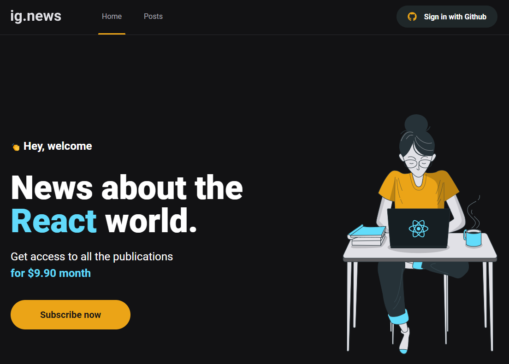
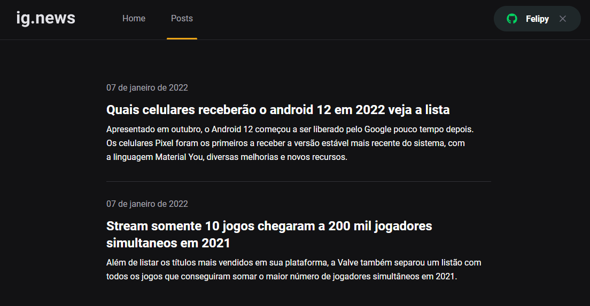

# BACK-END - IGNEWS - NEXT V12, SSR, TYPESCRIPT, PRISMA CMS, FAUNADB, STRIPE, SASS, ESLINT, AXIOS

Um sistema de notícias com acesso restrito, onde os usuários podem fazer login usando o GitHub e assinar conteúdo premium através do Stripe. Com recursos modernos e tecnologias como Prisma CMS, Next.js e TypeScript, oferece uma experiência de leitura sofisticada e segura.




## Tecnologias Utilizadas

- TYPESCRIPT
- NEXTJS
- REACT
- SASS
- STRIPE
- AXIOS
- PRISMA CMS
- SASS
- REACT-ICONS
- ESLINT
- WEBHOOK

## Funcionalidades

- Login pelo GitHub
- Assinatura de conteúdo premium via Stripe
- Exibição de notícias restritas aos assinantes
- Integração com Prisma CMS para gerenciamento de conteúdo
- Utilização de Webhooks para atualizações em tempo real

## Instalar e executar

- preencha o .env, informações dos serviços em links
- Entre na pasta do projeto
- Instale as dependências
```
    npm install
```
- Execute o projeto
```
    npm run dev
```

## Links

- [faunadb - database](https://v4.dashboard.fauna.com/db/us/IGNEWS)
- [stripe - dashboard](https://dashboard.stripe.com/test/developers)
- [stripe - webhook](https://docs.stripe.com/webhooks/quickstart)
- [stripe - checkout card data](https://docs.stripe.com/testing)
- [nextjs - github provider](https://next-auth.js.org/v3/providers/github)
